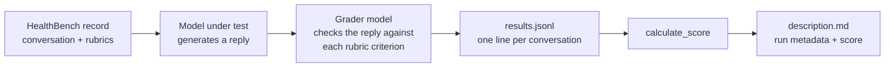

# evals-healthbench

A lightweight, reproducible harness for evaluating language models on **[HealthBench](https://openai.com/index/healthbench/)**, OpenAI's benchmark for how well models handle realistic health conversations with patients and clinicians.

The harness talks to any **OpenAI-compatible API** (Groq, Ollama, vLLM, OpenAI, etc.), so the model under test and the grader model can be swapped with a single `.env` change. Each run produces a timestamped folder with every response, every rubric judgement, and a final score.

## Results

Evaluated on random subsets of the HealthBench `oss_eval` split (sampled with `random_state=40`) to keep API costs down.

| Run | Model under test | Grader | Reasoning effort (test / grader) | Conversations | Score |
|---|---|---|---|---|---|---|
| `test-2026-09-26_17-22-17` | `openai/gpt-oss-20b` | `openai/gpt-oss-20b` | low / low | 100 | **0.531** |
| `test-2026-09-27_11-11-57` | `openai/gpt-oss-20b` | `openai/gpt-oss-20b` | low / low | 200 | **0.500** |

> These scores are not directly comparable to OpenAI's published HealthBench numbers: OpenAI grades with GPT-4.1 on the full 5,000-conversation set, while these runs use a smaller self-grading model on a subset. See [Limitations](#limitations).

## How it works



1. **Generate.** Each HealthBench record contains a multi-turn conversation. The model under test receives the conversation and writes the next assistant turn (temperature 0.3).
2. **Grade.** Every record comes with physician-written rubric criteria, each worth positive or negative points (e.g. *+8: mentions increased risk of falls*, *−5: recommends an unsafe dose*). The grader model is called once per criterion using the prompt template in [`GRADER.md`](GRADER.md) and must return structured JSON:
   ```json
   { "explanation": "...", "criteria_met": true }
   ```
   Responses are constrained with a JSON schema, and [`get_result`](pygrader/tools.py) extracts the first valid JSON object as a fallback for models that add extra text.
3. **Score.** For each conversation:

   $$\text{score} = \frac{\sum_i \text{met}_i \cdot \text{points}_i}{\sum_i \max(0, \text{points}_i)}$$

   i.e. points earned (negative criteria subtract when triggered) divided by the maximum achievable positive points. The final score is the mean across conversations, clipped to [0, 1].

## Repository structure

```
evals-healthbench/
├── eval.py            # Main script: runs generation, grading and scoring for one test run
├── GRADER.md          # Prompt template sent to the grader for each rubric criterion
├── eval.ipynb         # Data exploration, subset sampling, and score analysis
├── pygrader/
│   ├── models.py      # HeathBenchRecord and Rubric classes for parsing dataset lines
│   ├── grader.py      # grade(): calls the test model, then the grader per criterion
│   └── tools.py       # JSON extraction and score calculation
├── test-<timestamp>/  # One folder per run
│   ├── results.jsonl  # Prompt, completion and graded rubrics for every conversation
│   └── description.md # Dataset, models, reasoning effort, timestamp, score
└── requirements.txt
```

## Getting started

### 1. Environment

Requires **Python 3.12+** (the code uses nested quotes inside f-strings, which earlier versions reject). Developed with Python 3.12 on macOS (Apple Silicon) in a Miniconda environment.

```bash
conda create -n healthbench python=3.12
conda activate healthbench
pip install openai pandas numpy python-dotenv tqdm huggingface_hub jupyterlab
```

### 2. Download the dataset

```bash
hf download openai/healthbench --repo-type dataset --local-dir ./healthbench
```

The `healthbench/` folder is git-ignored.

### 3. Create a sample subset

Running the full set means tens of thousands of grader calls, so the runs above use random subsets. The sampling cells in `eval.ipynb` create them, or run:

```python
import pandas as pd

df = pd.read_json("healthbench/2025-05-07-06-14-12_oss_eval.jsonl", lines=True)
df.sample(n=200, random_state=40).to_json(
    "healthbench/2025-05-07-06-14-12_oss_eval_N200.jsonl", orient="records", lines=True
)
```

### 4. Configure `.env`

Create a `.env` file in the repo root:

```text
BASE_URL=https://api.groq.com/openai/v1   # or http://localhost:11434/v1 for Ollama
API_KEY=xxxxxx
MODEL_TEST=openai/gpt-oss-20b
MODEL_GRADER=openai/gpt-oss-20b
RESONING_TEST=low
RESONING_GRADER=low
```

| Variable | Purpose |
|---|---|
| `BASE_URL` | Endpoint of any OpenAI-compatible API |
| `API_KEY` | API key for that endpoint |
| `MODEL_TEST` | Model being evaluated |
| `MODEL_GRADER` | Model that grades responses against the rubrics |
| `RESONING_TEST` / `RESONING_GRADER` | `low`, `medium` or `high`; any other value omits the `reasoning_effort` parameter, for models that don't support it |

The dataset file is set by `DATASET` at the top of `eval.py` (default: the N200 subset).

### 5. Run

```bash
python eval.py
```

A progress bar tracks each conversation. When it finishes, results are in `test-<timestamp>/`.

## Customizing the grader

`GRADER.md` can be edited to change the grading instructions, as long as it keeps the three placeholders the script fills in: `{prompt}`, `{completion}` and `{criterion}`, and still asks for JSON with `explanation` and `criteria_met`. Literal braces must be doubled (`{{ }}`) because the template is filled with Python's `str.format`.

## Limitations

- **Subset evaluation.** Scores come from 100–200 of the 5,000 conversations, so expect a few points of sampling variance between runs (compare the N100 and N200 results).
- **Self-grading.** In these runs the grader is the same model being evaluated. OpenAI's reference setup uses GPT-4.1 as grader; a stronger, independent grader gives more trustworthy judgements.
- **Sequential calls.** Requests run one at a time, with no retries or rate-limit handling.

## Resources

- [HealthBench dataset on Hugging Face](https://huggingface.co/datasets/openai/healthbench)
- [HealthBench paper (arXiv:2505.08775)](https://arxiv.org/abs/2505.08775)
- [OpenAI's HealthBench announcement](https://openai.com/index/healthbench/)

## License

The code in this repository is released under the [Apache 2.0 License](LICENSE).

Third-party components are not covered by this license. The HealthBench dataset,
the evaluated and grader models, and the Python libraries used here are each
distributed under their own licenses and terms of use; please review them before
use or redistribution.

## Disclaimer

This project is for research and benchmarking only. Model responses in the
`test-*` folders are unreviewed AI output and are not medical advice.